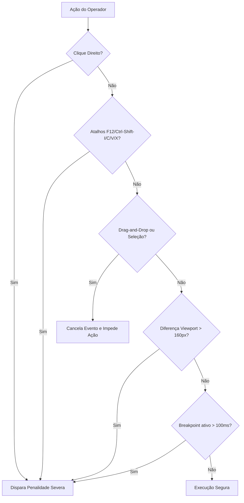
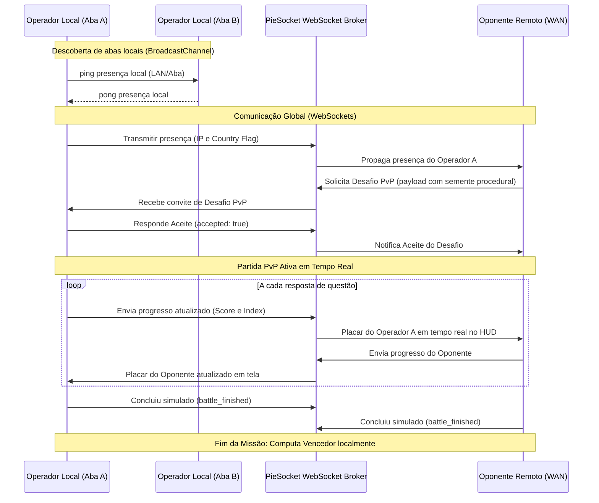
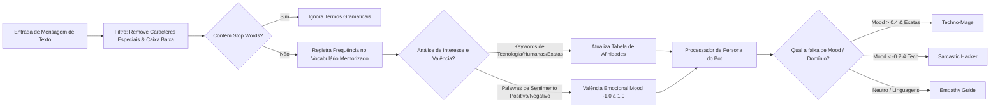

# 💎 Onyx Assessment Platform v4.0 - Manual de Arquitetura e Engenharia de Software
### *Especificações Técnicas, Algoritmos Heurísticos, Banco de Dados Criptográfico e Segurança de Integrity Shield*

Este documento constitui o guia arquitetural e de engenharia oficial para o sistema **Onyx Assessment Platform v4.0 - Premium Edition**. Ele detalha os subsistemas, a engenharia de dados em IndexedDB, a rede distribuída para pareamento PvP, os algoritmos heurísticos de performance de dados e o escudo de proteção cibernética integrada (Anti-Cheat).

---

## 1. Visão Geral da Arquitetura do Sistema

O **Onyx** opera sob o paradigma de **Client-Side Serverless de Alta Performance**. Toda a inteligência de processamento heurístico, renderização de áudio, processamento cognitivo em Processamento de Linguagem Natural (NLP) e persistência de dados ocorre localmente no navegador do operador. Isso elimina latência de rede em avaliações de tempo crítico, garante resiliência a desconexões e provê isolamento criptográfico.

```mermaid
graph TD
    subgraph Navegador do Operador (Client-Side)
        UI[onyx_ui.js: Síntese de Som & Particle System] <--> Core[onyx_core.js: Core & Progression Engine]
        Core <--> DB[onyx_db_manager.js: IndexedDB v14 Manager]
        DB <--> DB_Data[(OnyxEliteDB)]
        Core <--> Engine[onyx_engines.js: Algoritmos Heurísticos & Profiling]
        Core <--> Cognitive[onyx_cognitive.js: NLP & Personas Machine]
        Core <--> Net[onyx_network.js: PvP WebSockets & BroadcastChannel]
        Engine <--> Extremo[extremo.js: Ultimate Challenge Engine & ELO]
        
        Shield[Escudo Anti-Cheat: Teclado, DevTools & Debugger Trap] -.-> |Aplica Penalidade| Core
    end

    subgraph Infraestrutura Externa (Cloud Services)
        Net <--> |PieSocket WebSockets| Broker((PieSocket Global Broker))
        Net <--> |Geolocalização IP| Geoloc[ipapi.co REST API]
    end
    
    Broker <--> |Sincronização de Placar & Sementes PvP| Opponent[Operador Oponente]
```

### Acoplamento e Namespaces Globais
Os módulos do Onyx interagem de forma altamente desacoplada através da injeção de namespaces acoplados diretamente ao objeto global `window` do navegador:
* `window.OnyxCore`: Gateway centralizador de sessão (`Session`), utilitários criptográficos (`Crypto`), configurações de trilhas acadêmicas (`ProgressionConfig`) e o dicionário explicativo (`Tutor`).
* `window.OnyxDBManager`: Camada de abstração de dados encarregada pelo seed inicial de banco (`seed()`) e desduplicação de registros de questões.
* `window.OnyxEngines`: Motor heurístico de diagnóstico, cálculo de proficiência e insights preditivos por áreas da BNCC.
* `window.OnyxCognitive`: Motor cognitivo que processa strings linguísticas de chats em tempo real e calcula a valência emocional (mood) do operador.
* `window.OnyxNetwork`: Broker de sinalização local (`BroadcastChannel`) e remoto (`WebSocket`), controlando o pareamento dinâmico LAN/WAN de jogadores.
* `window.OnyxUI`: Motor de design, responsável por renderizar o boot no estilo Matrix Rain e a síntese oscilatória de som via Web Audio API.
* `UltimateChallengeEngine` (declarado em `extremo.js`): Motor de Data Science responsável pelas progressões acadêmicas em Elo e Repetição Espaçada.

---

## 2. Engenharia de Dados & Persistência (IndexedDB v14)

A persistência do Onyx é gerida através do **IndexedDB**, sob a base de dados transacional **`OnyxEliteDB`** (esquema v14). O banco é estruturado em cinco Object Stores transacionais de alta velocidade.

### Esquema Físico das Object Stores

```text
OnyxEliteDB (v14)
├── global_stats
│   └── keyPath: 'id'
├── history
│   └── keyPath: 'timestamp'
├── cached_questions
│   └── keyPath: 'id'
├── dynamic_questions
│   └── keyPath: 'id' (autoIncrement: true)
└── question_bank
    └── keyPath: 'id' (autoIncrement: true)
        ├── Índice 'subject' (unique: false)
        ├── Índice 'difficulty' (unique: false)
        ├── Índice 'sd' (composite mock "subject_difficulty", unique: false)
        └── Índice 'source' (unique: false)
```

1. **`global_stats`**: Registra os perfis de operadores e seus respectivos papéis de acesso (`aluno`, `gestor`, `responsavel`), senhas hash SHA-256 e níveis de XP.
   * *Seed Padrão de Contas (Senhas Hashing '1234'):*
     * `aluno`: Estudante padrão.
     * `gestor`: Gerente acadêmico com privilégios de bypass de segurança cibernética.
     * `responsavel`: Visualização analítica parental de progresso.
     * `OPERADOR MÓVEL` / `OPERADOR TESTE`: Operadores de contingência e emulação de viewport mobile.
2. **`history`**: Registra transações de missões concluídas pelo aluno para fins de auditoria acadêmica e extração de séries temporais de proficiência.
3. **`cached_questions`**: Cache de pool local e sementes de exames integrados por chaves compostas `${subject}_${difficulty}`.
4. **`dynamic_questions`**: Armazena questões geradas dinamicamente sob demanda.
5. **`question_bank`**: Armazém estruturado e persistente de questões procedurais, indexado por disciplinas (`subject`), dificuldades (`difficulty`), fonte (`source` = `'seed'` | `'generated'`) e chave composta simplificada (`sd` = `'subject_difficulty'`).

### Protocolo de Segurança e Integridade SHA-256 (Onyx Cryptography)
Para evitar que operadores adulterem seus níveis ou históricos de avaliação manipulando os stores no painel Application do navegador, o Onyx implementa uma verificação de integridade via assinatura criptográfica.

O processo de **Exportação de Banco de Dados** executa os seguintes passos:
1. Extração assíncrona de todos os registros das stores `global_stats`, `history` e `dynamic_questions`.
2. Serialização dos objetos JSON em uma string canônica bruta (`rawData`).
3. Computação do hash HMAC/SHA-256 utilizando a API nativa Web Crypto da seguinte forma:
   $$\text{Assinatura} = \text{SHA256}(\text{rawData} + \text{"OnyxSaltProtocolSecure1337!"})$$
4. Empacotamento do arquivo de saída contendo a assinatura e os dados brutos:
   ```json
   {
     "data": { ... },
     "signature": "8f3c4e...86e2"
   }
   ```

No processo de **Importação de Banco de Dados**, o sistema refaz a assinatura dos dados decodificados. Se houver desvio de um único caractere no payload do JSON, o sistema rejeita a transação acusando adulteração cibernética do banco de dados, interrompendo imediatamente o processo e mantendo o banco seguro.

---

## 3. Motor Pedagógico & Geração Procedural Infinita

O motor pedagógico do Onyx organiza o currículo acadêmico em **32 disciplinas** estruturadas de forma progressiva e categorizadas em trilhas de conhecimento alinhadas à Base Nacional Comum Curricular (BNCC), Novo Ensino Médio e Itinerários Formativos Técnicos:

| Nível / Tier | Disciplinas Mapeadas | Categoria de Habilidades |
| :--- | :--- | :--- |
| **Tier 1** | Português, Álgebra, História, Biologia, Inclusão & Acessibilidade | Fundamentos Essenciais da BNCC |
| **Tier 2** | Literatura, Geometria, Geografia, Física, Tecnologia | Consolidação e Práticas Científicas |
| **Tier 3** | Inglês, Estatística, Filosofia, Química, Empreendedorismo, Projeto de Vida | Ciências Humanas, Exatas & Soft Skills |
| **Tier 4** | Artes, Matemática Financeira, Sociologia, Robótica, Biblioteca Digital | Habilidades Críticas e de Inovação |
| **Tier 5** | Educação Física, Programação, Marketing Digital, Laboratório Virtual | Ferramentas Tecnológicas & Aptidões Físicas |
| **Tier 6** | Design Digital, Ciência de Dados, Educação Financeira | Profissionalização Tecnológica e Finanças |
| **Tier 7** | Produção Audiovisual, Inteligência Artificial, Segurança da Informação | Alta Tecnologia Avançada e Multimídia |
| **Tier 8** | Desenvolvimento de Jogos | Engenharia Multidisciplinar Avançada |

### Geração Procedural On-The-Fly (`getFreshPool` & Anti-Repetição)
Para prover infinitas simulações aos alunos sem redundância, o motor no arquivo `onyx_database.js` executa uma geração procedural adaptativa parametrizada. 

Toda questão gerada possui um esqueleto gramatical e lógico que consome dados de matrizes aleatórias (nomes de empresas reais, valores de faturamento de exatas, cenários de engenharia). A persistência impede a repetição através do fluxo de rastreio de chaves primárias:
1. Um array de identificadores de questões respondidas na sessão ativa do usuário é armazenado temporariamente em memória (`seenQuestions`).
2. Ao sortear um bloco da disciplina `x` e dificuldade `y`, o motor realiza uma filtragem cruzada `(pool.filter(q => !seenQuestions.includes(q.id)))`.
3. Caso a totalidade de questões exclusivas se esgote, a memória `seenQuestions` dessa disciplina é limpa e reciclada de forma invisível.

### Onyx Tutor System: Democratização dos Jargões
Para garantir acessibilidade cognitiva a operadores leigos ou neurodivergentes, o sistema integra o **Onyx Tutor**:
* **Destaques em Runtime:** O método `OnyxCore.Tutor.simplifyText` varre os enunciados das questões e as substitui recursivamente por elementos interativos HTML (`<span class="tutor-highlight">`) caso contenham jargões técnicos pré-definidos (ex: *BNCC, Mitocôndria, DevOps, Entropia, Machine Learning, Regressão Linear*).
* **Interface de Analogias:** Clicar em um termo realçado invoca `window.showTutorHint()`, que dispara um painel lateral dinâmico de visualização levitante contendo uma analogia simples e direta para o termo técnico.
* **Heurística de Custos e Compensações:**
  * Solicitar ajuda do Tutor adiciona automaticamente **+15 segundos** ao cronômetro da questão atual para permitir a leitura atenta da analogia sem prejuízo por estresse temporal.
  * Em contrapartida, o uso do Tutor é computado para fins de pontuação de proficiência, aplicando uma penalização linear progressiva de até 15% na pontuação final do teste da missão.

---

## 4. Algoritmos de Performance Heurística, Progressão & ELO

O Onyx não avalia o usuário meramente por acertos pontuais. Ele executa uma modelagem preditiva e diagnóstica complexa de sua proficiência cognitiva baseada em uma série de variáveis.

### Equação de Score Heurístico Adaptativo
A pontuação final de uma missão de treinamento concluída é dada pela seguinte modelagem matemática:

$$S_{\text{final}} = \max\left(0, \left\lfloor \left( S_{\text{base}} \cdot W_{\text{diff}} \cdot M_{\text{streak}} + P_{\text{efficiency}} \right) \cdot S_{\text{tutor}} \right\rfloor\right)$$

Onde:
* **$S_{\text{base}}$** representa a precisão de acerto linear do operador de 0 a 100:
  $$S_{\text{base}} = \left(\frac{C}{T}\right) \cdot 100$$
  *(sendo $C$ a quantidade de respostas corretas e $T$ o total de perguntas da missão)*
* **$W_{\text{diff}}$** representa o fator de peso ponderado da dificuldade selecionada:
  $$W_{\text{diff}} \in \{ \text{easy: } 1.0, \text{ medium: } 1.5, \text{ hard: } 2.2, \text{ insane: } 3.5, \text{ impossible: } 5.0 \}$$
* **$M_{\text{streak}}$** representa o multiplicador de marcos de acertos consecutivos (Streak):
  $$M_{\text{streak}} = \begin{cases} 
  2.0, & \text{se } \text{MaxStreak} \ge 10 \\ 
  1.5, & \text{se } \text{MaxStreak} \ge 5 \\ 
  1.2, & \text{se } \text{MaxStreak} \ge 3 \\ 
  1.0, & \text{caso contrário} 
  \end{cases}$$
* **$P_{\text{efficiency}}$** representa os pontos extras atribuídos à eficiência temporal e à consistência de velocidade de resposta. É a soma do Bônus de Tempo e do Bônus de Consistência:
  $$P_{\text{efficiency}} = B_{\text{time}} + B_{\text{consistency}}$$
  * O **Bônus de Tempo** ($B_{\text{time}}$) recompensa a resposta veloz:
    $$B_{\text{time}} = \max\left(0, \frac{200 - t_{\text{gasto}}}{200}\right) \cdot 20$$
  * O **Bônus de Consistência** ($B_{\text{consistency}}$) analisa a flutuação temporal das respostas através do **Desvio Padrão ($\sigma$)** do tempo gasto em cada questão. 
    Seja $H = [t_1, t_2, \dots, t_N]$ o vetor de tempos de resposta e $\mu$ a média de tempo gasta:
    $$\mu = \frac{1}{N} \sum_{i=1}^N t_i, \quad \sigma = \sqrt{\frac{1}{N} \sum_{i=1}^N (t_i - \mu)^2}$$
    A recompensa de consistência avalia se o ritmo cognitivo do aluno é uniforme:
    $$B_{\text{consistency}} = \begin{cases} 
    \max(0, 15 - (\sigma \cdot 2.5)), & \text{se } \sigma < 4.0 \text{ e } \mu < 10.0 \text{ s} \\
    10, & \text{se } \sigma < 2.0 \\
    0, & \text{caso contrário}
    \end{cases}$$
* **$S_{\text{tutor}}$** representa a escala de penalização de score devido ao uso de jargões simplificados pelo tutor:
  $$S_{\text{tutor}} = \max\left(0.85, 1.0 - \left(\frac{\text{tutor}_{\text{consultas}}}{T}\right) \cdot 0.15\right)$$
  *(sendo a penalidade máxima limitada a 15% de redução)*

---

### Algoritmo ELO & Repetição Espaçada (`extremo.js`)
O bootcamp extremo de dados em `extremo.js` implementa uma progressão quantitativa separada baseada em **ELO** e **Spaced Repetition (Intervalos de Revisão)**.

#### Atualização de Classificação ELO
A variação de ELO do usuário após um teste é baseada no sistema matemático internacional de xadrez:

$$R_{\text{novo}} = R_{\text{antigo}} + K \cdot (S - E)$$

Onde:
* **$K$** é o fator de escala de ajuste (fixado em **32**).
* **$S$** representa o score de sucesso obtido na prática (normalizado de 0.0 a 1.0).
* **$E$** representa a expectativa matemática de acerto com base na diferença de nível entre o operador e a questão de dificuldade $D$:
  $$E = \frac{1}{1 + 10^{\frac{R_{\text{questão}} - R_{\text{antigo}}}{400}}}$$

#### Agendamento de Repetição Espaçada
Com o intuito de combater a **Curva do Esquecimento de Ebbinghaus**, o sistema calcula intervalos ideais de revisão com base na proficiência. Matérias onde o operador apresenta baixo índice de proficiência entram em uma fila prioritária de agendamento de ciclos em dias:

$$\text{Próxima Revisão} = \text{Data Atual} + \text{Intervalo}[i] \text{ dias}$$

Onde $\text{Intervalo} = [1, 3, 7, 14, 30]$ dias. A classificação do ELO do usuário na disciplina dita se ele avança para o próximo estágio do vetor de intervalo ou se retrocede ao estágio $1$ (revisão em 24h).

---

## 5. Escudo Cibernético de Segurança (Anti-Cheat)

A integridade do ecossistema pedagógico Onyx é assegurada pelo **Onyx Protocol Security Integrity Shield**. Ele atua como um antivírus/anticheat embarcado no navegador, operando através de ganchos de eventos, inspeções geométricas do DOM e medições de tempos de ciclo de execução.



### Contramedidas Físicas e Digitais Ativas

1. **Bloqueio Completo de Atalhos Físicos e Eventos de Sistema:**
   * O escudo anula o evento `contextmenu` (bloqueando clique direito e botão de inspecionar).
   * Intercepta o evento `keydown` impedindo atalhos como `F12` (código de tecla `123`), `Ctrl+Shift+I` / `Ctrl+Shift+J` / `Ctrl+Shift+C`, `Ctrl+U` (visualização de código-fonte), `Ctrl+S` (salvamento de página offline) e `Ctrl+P` (impressão).
   * Desabilita a cópia, colagem e recorte nos eventos `copy`, `paste` e `cut` para evitar que códigos de exames sejam exportados ou colados externamente.
   * Modifica a captura de `selectstart` e `dragstart`, inviabilizando que o aluno selecione textos no DOM ou arraste imagens e elementos.
2. **Inspecionador Geométrico de Telas (DevTools Docked Detector):**
   * O escudo executa uma varredura constante a cada 1000 milissegundos comparando a resolução da janela física com a viewport útil de renderização HTML.
   * Se a janela útil for menor que a externa por uma margem de segurança configurada em 160 pixels de largura ou altura, o sistema identifica que as ferramentas do desenvolvedor (DevTools) estão acopladas no painel lateral ou inferior da tela:
     $$\Delta_{\text{width}} = \text{window.outerWidth} - \text{window.innerWidth} > 160$$
     $$\Delta_{\text{height}} = \text{window.outerHeight} - \text{window.innerHeight} > 160$$
3. **Armadilha do Depurador por Latência Temporal (Debugger Trap):**
   * O escudo executa um loop autônomo com uma instrução estrita de depuração (`debugger`).
   * O tempo de execução desse bloco é rigidamente mensurado utilizando temporizadores de precisão da API de performance do navegador:
     $$t_{\text{início}} = \text{performance.now()}$$
     $$\text{debugger;}$$
     $$t_{\text{fim}} = \text{performance.now()}$$
   * Sob condições normais com o DevTools fechado, a instrução de depuração é ignorada instantaneamente pela engine V8 ($t_{\text{fim}} - t_{\text{início}} \approx 0\text{ ms}$).
   * No entanto, se o console de desenvolvedor estiver ativo, a execução do Javascript sofrerá um congelamento (breakpoint). Ao retomar a execução, a latência temporal excederá a janela de segurança de 100 milissegundos ($t_{\text{fim}} - t_{\text{início}} > 100\text{ ms}$), denunciando a tentativa de inspecionar variáveis em tempo de execução.

### Regras de Anistia e Penalidades Cruas
Qualquer violação detectada aciona o método de punição de segurança centralizado no Onyx Core, governado pelas seguintes regras rígidas:
* **Modo Sandbox / Localhost:** Se o servidor estiver rodando localmente (`localhost`, `127.0.0.1` ou protocolo `file:`) ou se o papel da conta ativa for de `gestor`, o sistema apenas registrará uma advertência no console de depuração, ignorando a punição para viabilizar manutenção técnica.
* **Modo Produção Acadêmica (Ambiente Restrito):**
  * **Primeira Ocorrência (Sistema de Anistia Única):** O operador recebe uma advertência formal em tela detalhando a violação e criando uma chave persistente no LocalStorage (`onyx_cheat_warn_${user}`). A sessão ativa continua sob observação.
  * **Segunda Ocorrência em Diante (Penalidade Extrema):** O nível de progressão do perfil do operador sofre um rebaixamento de **-1 Nível** (travado no nível 1 como mínimo). Toda a pontuação de XP acumulada do nível atual é instantaneamente zerada (`xp = 0`). O operador é desautenticado e ejetado diretamente para o Dashboard acadêmico, rebloqueando na mesma hora todas as disciplinas e acessos a exames que exigiam o nível perdido.

---

## 6. Sistema de Rede Multi-Tab BroadcastChannel & WebSockets (PvP)

O subsistema distribuído do Onyx (`onyx_network.js`) provê emparelhamento em tempo real e torneios interativos PvP sem necessidade de bancos de dados centralizados ou servidores dedicados de jogo. Ele atua de forma híbrida utilizando WebSockets e BroadcastChannels locais.



### Componentes de Rede e Fluxo Operacional

1. **Protocolo Geográfico LAN/WAN:**
   Na inicialização, o cliente executa uma consulta HTTP assíncrona contra a API `https://ipapi.co/json/`. O JSON de resposta fornece o IP público da máquina e o código do país.
   * O sistema traduz o código do país em um emoji de bandeira física (ex: `BR` $\rightarrow$ 🇧🇷) que passa a compor a assinatura visual do avatar do operador na arena.
   * Se o IP público de dois operadores na lista de presenças for rigorosamente idêntico, o motor os classifica com a tag **`REDE LOCAL (LAN)`**, agrupando de forma dedicada estudantes no mesmo laboratório de informática escolar. Se os IPs divergirem, são classificados como **`REDE REMOTA (WAN)`**.
2. **PieSocket WebSocket Broker:**
   O canal remoto consome a infraestrutura pública do PieSocket. As presenças e convites trafegam sob o canal seguro WebSocket, propagando pings a cada 3000 milissegundos para evitar desconexões por tempo ocioso.
3. **Protocolo de Paridade Heurística:**
   Para garantir concorrência leal de tempo de resposta em batalhas PvP, o criador do desafio executa localmente a geração de questões. Esse vetor estruturado de perguntas é encapsulado em formato JSON bruto dentro do payload `challenge_request` transmitido. Ao aceitar o desafio, o oponente consome exatamente o mesmo array de dados recebido, assegurando paridade absoluta de textos, ordens e dificuldades de questões.
4. **BroadcastChannel Local Fallback:**
   Para fins de testes, simulações sem conexão externa ou demonstrações em múltiplas abas do mesmo dispositivo, o Onyx instancia um canal de transmissão física no navegador (`new BroadcastChannel('onyx_local_pvp')`). Todos os sinais e payloads de WebSockets são replicados de forma idêntica no barramento do canal local, viabilizando partidas PvP simultâneas no mesmo browser.

---

## 7. Processamento Cognitivo de NLP & Inteligência de Bot

A central de comando do Onyx abriga um motor de **Inteligência Artificial Cognitiva** (`onyx_cognitive.js`) que aprende interativamente a partir dos diálogos de chat e interações linguísticas do operador.



### Análise de Sentimento & Valência Emocional
Toda mensagem enviada pelo usuário na arena ou painel de IA passa por um tratamento de remoção de pontuação e tokenização de strings em palavras com tamanho superior a 3 caracteres.
* **Filtro de Stop Words:** Palavras comuns do idioma português sem peso semântico acadêmico (ex: *para, como, com, uma, mais, este, tudo*) são descartadas.
* **Cálculo do Mood Index (Valência):** O índice emocional da IA inicia em um nível neutro-positivo de $0.2$, oscilando na escala fechada $[-1.0, 1.0]$. O sistema analisa o vetor de tokens contra dois dicionários estáticos de sentimentos:
  $$\text{Mood} = \text{clamp}\left(-1.0, \, 1.0, \, \text{Mood}_{\text{atual}} + 0.15 \cdot N_{\text{positivos}} - 0.15 \cdot N_{\text{negativos}}\right)$$
  *(sendo palavras positivas ex: "boa", "ganhei", "fácil", "sucesso" e negativas ex: "difícil", "ruim", "bug", "perdi")*

### Classificador de Afinidades e Interesses Acadêmicos
Os termos processados também são cruzados com dicionários de interesses temáticos para atualizar uma pontuação acumulada de afinidade em cinco grandes eixos: `tecnologia`, `matematica`, `natureza`, `humanas` e `linguagens`. A categoria que possuir a maior somatória acumulada de termos classificados define o **Domínio Dominante** do operador.

### Máquina de Estados de Personas do Bot
A inteligência do bot utiliza o Mood Emocional calculado e o Domínio Dominante para sofrer transições dinâmicas entre três personalidades com respostas e vocabulários contextuais gerados por amostragem probabilística:

1. **Techno-Mage (Mago Tecnológico):**
   * *Gatilho:* $\text{Mood} > 0.4$ e Domínio Dominante em $\text{matematica}$, $\text{natureza}$ ou $\text{tecnologia}$.
   * *Estilo Linguístico:* Fusão de jargões técnicos com misticismo cibernético, tratando a matemática e programação como runas e magia de computação quântica.
2. **Sarcastic Hacker (Hacker Sarcástico):**
   * *Gatilho:* $\text{Mood} < -0.2$ e Domínio Dominante em $\text{tecnologia}$ ou $\text{matematica}$.
   * *Estilo Linguístico:* Sarcasmo cru, referências a bugs e falhas humanas, alertando sobre "vazamentos de memória cognitivos nos neurônios do operador".
3. **Empathy Guide (Guia Empático):**
   * *Gatilho:* Estado padrão neutro ou quando o domínio de afinidade está associado a $\text{humanas}$ ou $\text{linguagens}$.
   * *Estilo Linguístico:* Apoio humanizado, acolhimento pedagógico e incentivo para superar barreiras de aprendizagem sem estresse acadêmico.

---

## 8. Renderização UX & Áudio Dinâmico

O Onyx prioriza a excelência visual e autonomia técnica através de dois pilares principais:

### Síntese Oscilatória Dinâmica (Web Audio API)
Para eliminar qualquer necessidade de ativos e arquivos de áudio estáticos (`.mp3` ou `.wav`) que poderiam falhar ao carregar ou atrasar o feedback instantâneo da interface, o subsistema `onyx_ui.js` gera frequências e ondas sintetizadas em tempo real consumindo as APIs de baixo nível de áudio do próprio browser.

Abaixo, os blocos técnicos de síntese utilizados nos principais eventos do sistema:

```javascript
// Exemplo de Sintetizador de Sucesso Heurístico (Acerto de Questão)
function playOnyxSuccessSound() {
    const ctx = new (window.AudioContext || window.webkitAudioContext)();
    const osc = ctx.createOscillator();
    const gain = ctx.createGain();
    
    osc.connect(gain);
    gain.connect(ctx.destination);
    
    // Onda senoidal de tom cristalino e limpo
    osc.type = 'sine';
    
    // Efeito de Arpeggio Ascendente Rápido
    const now = ctx.currentTime;
    osc.frequency.setValueAtTime(587.33, now); // Ré5
    osc.frequency.setValueAtTime(880.00, now + 0.08); // Lá5
    osc.frequency.setValueAtTime(1174.66, now + 0.16); // Ré6
    
    // Curva de decaimento de volume suave (Gain Envelope)
    gain.gain.setValueAtTime(0.15, now);
    gain.gain.exponentialRampToValueAtTime(0.0001, now + 0.4);
    
    osc.start(now);
    osc.stop(now + 0.4);
}

// Exemplo de Sintetizador de Erro Cognitivo (Resposta Incorreta)
function playOnyxErrorSound() {
    const ctx = new (window.AudioContext || window.webkitAudioContext)();
    const osc = ctx.createOscillator();
    const gain = ctx.createGain();
    
    osc.connect(gain);
    gain.connect(ctx.destination);
    
    // Onda dente de serra para um tom mais áspero de alerta
    osc.type = 'sawtooth';
    
    // Glissando Descendente e Grave
    const now = ctx.currentTime;
    osc.frequency.setValueAtTime(180.00, now);
    osc.frequency.linearRampToValueAtTime(80.00, now + 0.3);
    
    gain.gain.setValueAtTime(0.2, now);
    gain.gain.exponentialRampToValueAtTime(0.0001, now + 0.3);
    
    osc.start(now);
    osc.stop(now + 0.3);
}
```

### Efeitos Visuais & Matrix Code Rain Column
* **Variáveis HSL Dinâmicas:** A paleta de cores consome variáveis CSS globais baseadas no sistema HSL (Hue, Saturation, Lightness). Ao alterar ou subir de nível, o sistema altera programaticamente os graus do Hue (`--accent-hue`) na raiz do DOM, alterando dinamicamente a tonalidade brilhante dos gradientes de toda a plataforma sem carregar novos arquivos de imagem ou stylesheets.
* **Canvas Matrix Rain Background:** A inicialização do sistema ativa um script que desenha no elemento canvas colunas verticais de códigos binários e hexadecimais caindo com velocidades variáveis, emulando terminais cibernéticos retro-futuristas com um gradiente translúcido de alfa `0.05` para criar persistência de brilho (trail effect).

---

## 9. Manutenção & Extensibilidade do Código

O manual a seguir estabelece as diretrizes para os engenheiros que desejam estender as rotinas do Onyx:

1. **Alteração no Esquema de Banco de Dados:**
   Toda modificação estrutural nas Object Stores deve ser acompanhada do incremento estrito da versão de banco declarada na chamada `indexedDB.open('OnyxEliteDB', v)` localizada em `onyx_core.js`, com a respectiva lógica de migração e criação de stores implementada sob a função `request.onupgradeneeded`.
2. **Criação de Novas Disciplinas Acadêmicas:**
   Novas disciplinas devem ser registradas na estrutura do dicionário `ProgressionConfig.subjects` informando seu nível hierárquico mínimo de liberação de 1 a 8. Em seguida, novas matrizes de perguntas procedurais devem ser mapeadas sob o gerador procedural de `onyx_database.js`.
3. **Novas Armadilhas Anti-Cheat:**
   Ganchos e interceptadores adicionais devem ser encapsulados na IIFE autoexecutável de segurança em `onyx_core.js` para garantir escopo isolado de proteção e impedir sua manipulação através do console do navegador.

---
*Manual de Arquitetura Onyx v4.0.0-STABLE | Licenciado sob Protocolo de Engenharia Educacional Technovie 2026*
